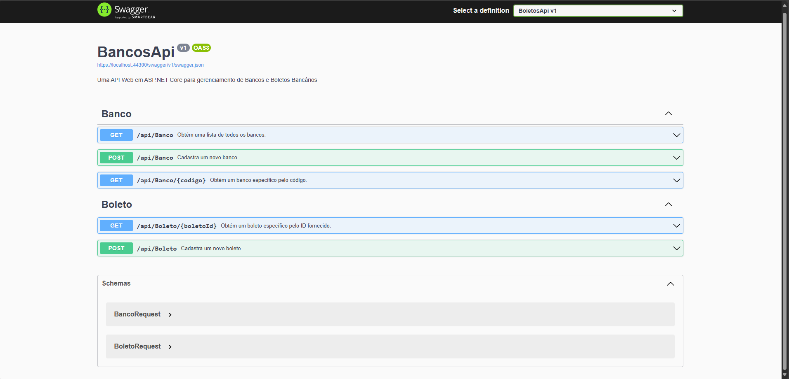

<h1 align="center">
<br>
  

<br />
BoletosApi
</h1>

## Tools
Esta aplicação é uma API desenvolvida com ASP.NET Core para gerenciamento de boletos e bancos, incluindo funcionalidades para criação e leitura de registros.

- 💻 **ASP.NET Core 6** — Framework para desenvolvimento web
- 🗃️ **Entity Framework Core** — ORM para simplificar o acesso ao banco de dados
- 💾 **Postgres** — Banco de dados relacional
- 🔄 **AutoMapper** — Biblioteca para mapeamento de objetos
- 📝 **Swagger** — Documentação Open API 

## Getting started

1. Clone esse repositorio utilizando `git clone https://github.com/Andrehrc/BoletosApi.git`
2. Acesse o diterório do projeto: `cd BoletosApi`<br />
3. Rode `dotnet restore` para instalar as dependências<br />

## Prepare o ambiente do banco de dados
4. Certifique-se de ter o Dotnet Ef instalado, que pode ser feito com o comando `dotnet tool install --global dotnet-ef` 
5. Rode o comando `dotnet ef migrations add InitialCreate --project BoletosApi` para gerar migrations 
6. Se necessário, atualize a string de conexão no arquivo `appsettings.json` para refletir as configurações do seu banco de dados:
  ```json
   "ConnectionStrings": {
     "DefaultConnection": "Host=localhost;Port=SuaPorta;Database=Boletos;Username=SeuUsuario;Password=SuaSenha"
   }
   ```

## Prepare o ambiente de desenvolvimento e execute a aplicação
7. Caso esteja utilizando Windows, execute o comando `set ASPNETCORE_ENVIRONMENT=Development` para atualizar o ambiente de para desenvolvimento<br />
8. Execute o comando `dotnet run --project BoletosApi` para iniciar a aplicação<br />
9. Caso esteja utilizando Mac ou Linux, execute o comando `ASPNETCORE_ENVIRONMENT=Development dotnet run --project BoletosApi` para atualizar o ambiente de para desenvolvimento e iniciar a aplicação<br />

## Funcionalidades

- **Gerenciamento de Boletos:** Criação e leitura de boletos.
- **Gerenciamento de Bancos:** Criação e leitura de informações bancárias.
- **Validação de Dados:** Validações nos campos de entrada.
- **Documentação Swagger:** Interface para explorar e testar a API.

## Endpoints

- `GET /api/bancos`: Obtém a lista de bancos.
- `GET /api/bancos/{codigo}`: Obtém um banco específico pelo código.
- `POST /api/bancos`: Cadastra um novo banco.
- `GET /api/boletos/{boletoId}`: Obtém um boleto específico pelo ID.
- `POST /api/boletos`: Cadastra um novo boleto.

## Documentação

A documentação da API está disponível em Swagger após iniciar o projeto.

<br />

<br />